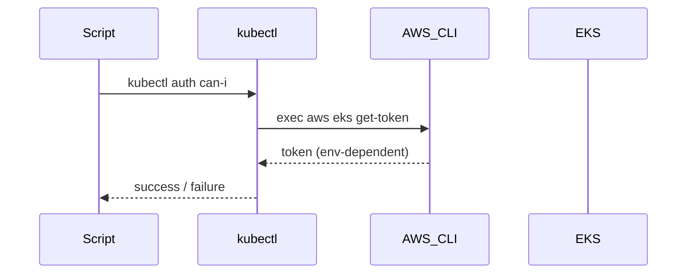

## ==== Rule 1: Maintain `README_WAR_STORIES.md` ====

### Purpose
Maintain a living document of **non-trivial technical war stories** (lessons learned)
derived from chat interactions, suitable for long-term learning and **senior-level
technical interview talking points**.

---

### Rules

1. **Update or create** a file named `README_WAR_STORIES.md` for this project.
   - If the file does not exist, **create it**.

2. The file must be updated with the **latest valuable technical lessons (“war stories”)**
   learned from the chat.

3. Each war story **must include**:
   - `creation`: timestamp in format `<YYMMDD-hhmmss>`
   - `last_updated`: timestamp in format `<YYMMDD-hhmmss>`
   - Keywords describing the technology area(s)
   - Difficulty level: integer **1–10** (1 = easiest, 10 = hardest)
   - Significance level: integer **1–10**
     (10 = most significant and most impressive for senior technical interviews)

4. **Do not create a new war story for every chat interaction.**
   Instead:
   - Evaluate chat activity **at each full hour** while Cursor is running
   - Compare the time of relevant questions/answers against the
     `last_updated` timestamp of the most recent war story
   - Decide wisely whether to:
     - Enhance an existing war story
     - Create a new war story
     - Or do both

5. Each war story must:
   - Capture a **clear, accurate, and precise technical lesson**
   - Be **informative but not verbose**
   - Focus on **non-trivial, real-world insights**
   - Be easy to follow
   - Use **Mermaid diagrams where they meaningfully improve clarity**

6. Each war story and its internal sections **must be clearly numbered**.

7. Other than diagrams:
   - The textual content of each war story **must be under 200 words**

8. After updating `README_WAR_STORIES.md`:
   - **Double-check** the content you modified for correctness, clarity, and formatting.

---

### Quality Bar
Only include war stories that represent **significant technical lessons**, suitable for:
- Deep learning and future reference
- Discussion in **senior or staff-level technical interviews**

---

## Canonical Example Entry (Format-Locking)

This entry defines the **permanent structure** that all future war stories must follow.

---

## 1. EKS Exec Plugin Authentication Failure in Non-Interactive Contexts

**creation:** `<260118-214500>`  
**last_updated:** `<260118-214500>`

**keywords:** AWS, EKS, Kubernetes, kubectl, IAM, exec-plugin  
**difficulty:** 7  
**significance:** 8  

### 1.1 Context
Automated EKS access checks (`kubectl auth can-i`) failed with
**“Token check FAILED after refresh”** when executed inside scripts, while identical
commands succeeded interactively.

### 1.2 Root Cause
EKS authentication relies on a **kubectl exec plugin** invoking
`aws eks get-token`. In non-interactive shells, required environment variables
(e.g. `AWS_PROFILE`) were **not inherited**, causing token generation to fail.

### 1.3 Key Insight
> Apparent EKS authentication flakiness is usually a deterministic
> **environment propagation issue**, not an IAM or cluster problem.

### 1.4 Resolution
Explicitly export AWS credential context inside the same execution environment
where `kubectl` runs, and validate authentication from that context.

### 1.5 Takeaway
When debugging EKS authentication, always test **where the process runs**,
not where the command works.

### 1.6 Diagram

