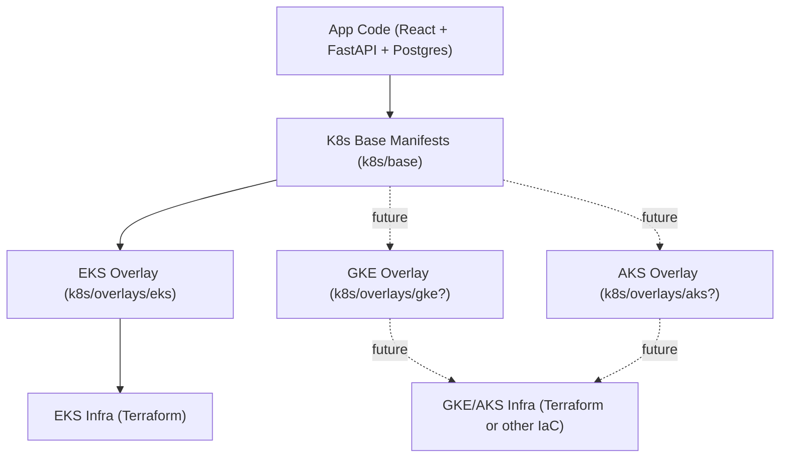

## 1. Project Purpose: Portable Kubernetes Full-Stack App

This project is a reference implementation of a **simple, production‑style full‑stack application** (React + FastAPI + Postgres) that is designed to be **as portable as possible across Kubernetes clusters on different cloud providers** (EKS, GKE, AKS, etc.).

The core idea is:

- **Keep the application stack and Kubernetes manifests cloud‑agnostic by default**.
- **Isolate cloud‑specific behavior into thin overlays and scripts**, so that moving to another provider is mostly about:
  - Swapping the infrastructure layer (Terraform modules or equivalent).
  - Adding a new, small Kustomize overlay per cloud.
  - Adjusting a few deploy/runtime scripts.

This README focuses on the structure and conventions that make that portability possible. (For a more narrative description/motivation, see the design discussion in the shared notes referenced in the prompt [`https://chatgpt.com/s/t_697071e0fd90819182d955c66dd737db`](https://chatgpt.com/s/t_697071e0fd90819182d955c66dd737db).)

---

## 2. High‑Level Architecture

### 2.1 Application Components (Cloud‑Agnostic)

- **Backend API** (`app/backend`)
  - Python FastAPI service, packaged as a Docker image.
  - Embeds a static CSV dataset at build time for deterministic behavior.
  - Talks to Postgres via standard `PG*` environment variables.

- **Frontend UI** (`app/frontend`)
  - Vite/React single‑page app, built to static assets.
  - Served by a generic Nginx container; no cloud‑specific configuration.

- **Database** (Postgres)
  - Standard `postgres:16` container.
  - Uses a PVC for persistent storage, with storage class provided by the overlay.

All of these are **pure containers + standard K8s resources**, with no direct coupling to a specific cloud provider.

### 2.2 Kubernetes Layer

We split Kubernetes configuration into:

- **Base manifests** (`k8s/base/`)
  - `namespace.yaml`, `api.yaml`, `ui.yaml`, `postgres.yaml`, `postgres-secret.yaml`, `ingress.yaml`, `kustomization.yaml`.
  - These define:
    - Services, Deployments, StatefulSet, Ingress.
    - Labels and selectors.
    - Container images using **placeholder image names** (`REPLACE_WITH_YOUR_REGISTRY/...`).
    - PVC templates that **do not** hard‑code a storage class.
  - Intentionally **cloud‑agnostic**: nothing here assumes EKS, GKE, or AKS.

- **Cloud overlay** (`k8s/overlays/eks/` for now)
  - A Kustomize overlay that:
    - Reuses `../../base` as its only resource.
    - Rewrites placeholder images to real ECR image URLs.
    - Adds a cloud‑specific storage class to the Postgres PVC.
  - This overlay is where we “plug in” cloud‑specific knobs while keeping base manifests portable.

### 2.3 Infrastructure Layer (Cloud‑Specific)

- **Terraform for EKS** (`infra/terraform`)
  - Uses `terraform-aws-modules` for VPC + EKS.
  - Provisions:
    - VPC, subnets, NAT gateway, routing.
    - EKS control plane + managed node group.
    - IAM roles and OIDC provider.
    - EBS CSI driver addon (via scripts) and default storage class (`gp2`).
  - Cloud‑specific concerns live here:
    - AWS IAM limits and naming.
    - Load balancer behavior (NLB via annotations).
    - Storage classes (`gp2`, CSI driver configuration).

Today, the infra layer only targets **EKS**, but the same pattern would apply for GKE/AKS via alternative Terraform modules or IaC stacks.

---

## 3. Portability Strategy

### 3.1 Maximize Cloud‑Agnostic App & Manifests

We design the **base app and manifests** so they can run on:

- Any conformant Kubernetes cluster.
- Any container runtime that supports standard OCI images.

Key practices:

- **No cloud‑specific annotations in `k8s/base`**
  - Ingress, Services, Deployments, StatefulSet, and PVCs are generic.
  - Example: the base PVC leaves `storageClassName` unset; the overlay patches it.

- **Placeholder image names in base manifests**
  - `k8s/base/api.yaml` and `k8s/base/ui.yaml` use:
    - `REPLACE_WITH_YOUR_REGISTRY/stats-api:0.4.0`
    - `REPLACE_WITH_YOUR_REGISTRY/stats-ui:0.4.0`
  - This keeps base manifests independent of:
    - Registry type (ECR, GCR, ACR, Docker Hub).
    - Account IDs and regions.
  - Overlays or deploy scripts inject the correct images at runtime.

- **Standard K8s primitives only**
  - No CRDs or cloud‑specific resources in base.
  - Ingress uses the generic `nginx` class, assuming an ingress controller is installed by the infra/deploy layer.

### 3.2 Thin Cloud‑Specific Overlays

For each cloud, we keep a **small overlay** that:

- **Extends the base manifests** instead of duplicating them.
- Injects only what is truly cloud‑specific.

In the current EKS overlay (`k8s/overlays/eks/kustomization.yaml`):

- **Image replacement**:
  - Uses Kustomize `images` to map placeholders to ECR:
    - `744139897900.dkr.ecr.us-east-1.amazonaws.com/fridge-stats-api:0.4.0`
    - `744139897900.dkr.ecr.us-east-1.amazonaws.com/fridge-stats-ui:0.4.0`

- **Storage class patch** (Postgres PVC):
  - Uses JSON6902 patch to add `storageClassName: gp2` to the StatefulSet’s `volumeClaimTemplates`.
  - This is required because each cloud has its own storage class names and CSI setup.

Nothing else in the overlay is AWS‑specific. To support GKE or AKS, we would:

- Create `k8s/overlays/gke/` or `k8s/overlays/aks/`.
- Point `resources` to `../../base`.
- Add:
  - `images:` mapping to GCR/Artifact Registry/ACR.
  - A PVC patch for GCE PD or Azure Disk storage classes.

### 3.3 Scripts that Orchestrate but Don’t Lock In

The shell scripts under the root and `run_scripts/` orchestrate the lifecycle, but are structured to keep the **app logic** detached from provider specifics:

- **`run.sh`**
  - High‑level driver: `infra`, `deploy`, `test`, `all`, `down`.
  - Uses a minimal set of env vars from `.env`:
    - `AWS_REGION`, `AWS_PROFILE`
    - `CLUSTER_NAME`, `PROJECT_ID`
    - `IMAGE_TAG`, `ECR_REPO_PREFIX`
  - Delegates detailed logic to sub‑scripts.

- **`run_scripts/infra.sh` (EKS‑specific today)**
  - Wraps `terraform` apply/destroy for EKS VPC+cluster.
  - Exposes a simple interface to the rest of the project:
    - “Give me a working Kubernetes endpoint + node group.”
  - If we add GKE or AKS support, we can either:
    - Add flags/modes to call different Terraform root modules.
    - Or have separate `infra_gke.sh` / `infra_aks.sh` scripts.

- **`run_scripts/deploy.sh`**
  - Responsible for:
    - Building Docker images (for now using ECR + `--platform linux/amd64`).
    - Installing ingress‑nginx via Helm.
    - Applying Kustomize overlay manifests.
    - Waiting for Deployments and Ingress LB to be ready.
  - The main cloud‑specific bits are:
    - ECR login & repo creation (EKS‑only today).
    - `INGRESS_NLB=true` annotation for AWS NLB.
  - These are well‑isolated:
    - Image build/push could be parameterized to target GCR/ACR.
    - LB annotations can be moved behind a cloud‑specific flag or overlay.

- **`run_scripts/smoke.sh`**
  - Pure HTTP checks against the LB endpoint:
    - `/api/healthz`, `/api/stats`, `/`.
  - No AWS/GCP/Azure logic; works the same on any platform.

This structure lets us:

- Reuse 90%+ of the deploy & test logic across clouds.
- Only swap out the infra + image registry details per provider.

---

## 4. How This Maps to Other Clouds (Conceptually)

Although this repo currently ships only an EKS implementation, it’s designed so that:

- **Adding GKE support** would involve:
  - New Terraform root (or other IaC) to create:
    - GKE cluster, node pools, GCE PD CSI driver, default storage class.
  - `k8s/overlays/gke/kustomization.yaml`:
    - Map images to GCR/Artifact Registry.
    - Patch Postgres PVC with a GCE PD storage class (`standard`, `premium-rwo`, etc.).
  - Extend `run_scripts/infra.sh` / `deploy.sh` to:
    - Use `gcloud`/`gcloud auth configure-docker` for image push.
    - Configure `kubectl` context via `gcloud container clusters get-credentials`.

- **Adding AKS support** would be similar:
  - Azure‑specific Terraform or Bicep for:
    - AKS cluster, node pools, CSI drivers, storageclasses.
  - `k8s/overlays/aks/` with:
    - Image mapping to ACR.
    - PVC patch for Azure Disk/Files.
  - Script changes to use `az`/`acr login` and `kubelogin`/`az aks get-credentials`.

The important part is that **`k8s/base` and the application code do not change**—all cloud adaptations are kept in:

- Infra modules (EKS vs GKE vs AKS).
- Per‑cloud Kustomize overlays and registry/image wiring.
- Small, well‑scoped differences in deploy scripts.

---

## 5. Practical Takeaways

- You can treat this repo as a **template for portable K8s apps**:
  - Drop in your own API/UI containers.
  - Keep `k8s/base` cloud‑agnostic.
  - Add a small overlay per cloud to inject:
    - Image registry + tags.
    - Storage classes and ingress annotations.

- The current EKS implementation demonstrates:
  - End‑to‑end flow from Terraform → EKS → Helm ingress‑nginx → Kustomize → Smoke tests.
  - How to keep the bulk of that flow provider‑neutral so that it can be replicated on other managed Kubernetes offerings with minimal changes.

This document is intentionally “structure‑level”; the main `README.md` focuses more on step‑by‑step usage, while `README_STRUCTURE.md` explains **why the repo is organized this way** to maximize portability and minimize cloud‑specific surface area.

