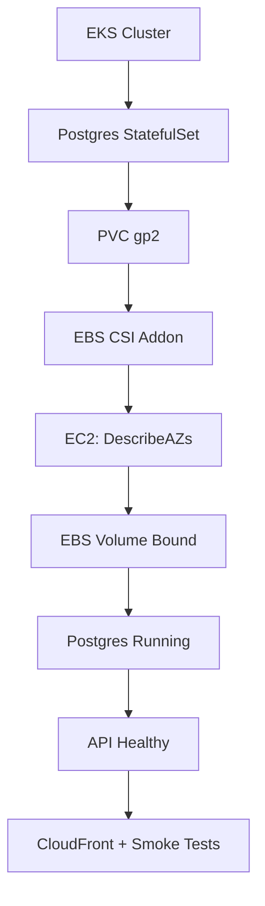
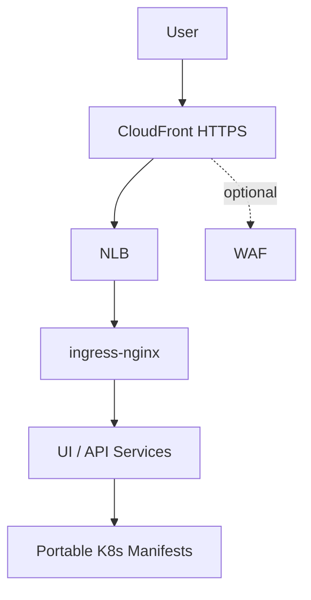
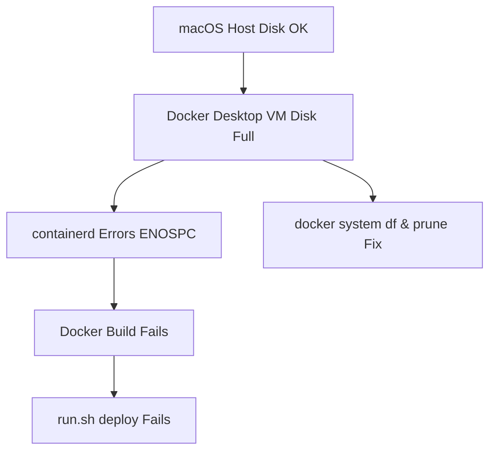
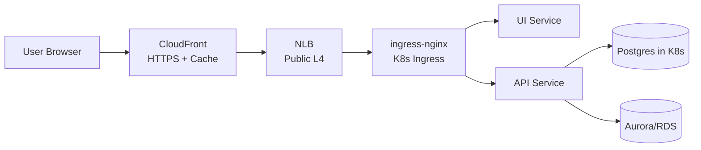

## 1. EKS Storage, EBS CSI Addon, and Idempotent App Deployments

**creation:** `<260121-120000>`  
**last_updated:** `<260121-120000>`

**keywords:** AWS, EKS, Kubernetes, EBS CSI, Terraform, Helm, CloudFront  
**difficulty:** 7  
**significance:** 8  

### 1.1 Context
An EKS-based demo app used Postgres via a StatefulSet and a `gp2` StorageClass. PVCs stayed Pending, Postgres never scheduled, and the API crashed on startup while `run.sh all` hung on deployment readiness.

### 1.2 Root Cause
Dynamic EBS provisioning requires the `aws-ebs-csi-driver` addon plus EC2 IAM permissions on the node role. The cluster lacked both the addon and the `AmazonEBSCSIDriverPolicy` attachment, so the CSI controller crashed with `UnauthorizedOperation` on `ec2:DescribeAvailabilityZones`, blocking volume creation.

### 1.3 Key Insight
> When StatefulSet PVCs hang in Pending on EKS, always validate **both**: the CSI addon health and node-role IAM permissions for EC2 APIs used by that driver.

### 1.4 Resolution
We wired Terraform to attach `AmazonEBSCSIDriverPolicy` to the node IAM role and extended `run_scripts/infra.sh` to create the `aws-ebs-csi-driver` addon when `USE_POST_DB_IN_KUBE=true`. Once the CSI controller stabilized, Postgres scheduled, the API became healthy, and `run.sh all` (infra + deploy + CloudFront + smoke tests) ran idempotently end-to-end.

### 1.5 Diagram

## 2. Cloud-Portable Ingress: NLB, CloudFront, and Idempotent `run.sh`

**creation:** `<260121-120100>`  
**last_updated:** `<260121-120100>`

**keywords:** AWS, EKS, ingress-nginx, NLB, CloudFront, WAF, Bash, Terraform  
**difficulty:** 6  
**significance:** 7  

### 2.1 Context
A “portable core + thin AWS overlay” design needed HTTPS and CDN in front of an EKS ingress, without polluting Kubernetes manifests with cloud specifics, while keeping `run.sh all` idempotent and observable.

### 2.2 Root Cause
Naive approaches hard-wire CloudFront or WAF logic into manifests or Terraform modules, making portability poor and cleanup brittle. Logging and monitoring for `run.sh` were also ad hoc, hiding long waits and partial failures.

### 2.3 Key Insight
> Treat CloudFront, WAF, and NLB as an **AWS-only edge layer**, orchestrated by scripts, while the app and Kustomize base stay cloud-agnostic.

### 2.4 Resolution
We pushed ingress-nginx + app manifests into a portable `k8s/base`, kept EKS specifics in `k8s/overlays/eks`, and added `run_scripts/cloudfront.sh` plus `ENABLE_CLOUDFRONT`. `run.sh` was refactored into stages with colored logs, `wait_with_retry`, log files under `run_logs/`, and `down-all` / `all-preempted` commands so CloudFront, NLB, and ECR are recreated cleanly on every full run.

### 2.5 Diagram

## 3. Docker Desktop “No Space Left on Device” Inside the VM

**creation:** `<260121-120200>`  
**last_updated:** `<260121-120200>`

**keywords:** Docker Desktop, macOS, containerd, disk usage, diagnostics  
**difficulty:** 5  
**significance:** 6  

### 3.1 Context
Running `run.sh deploy` failed early with “Cannot connect to the Docker daemon” on macOS, even though `df -h` on the host showed ample free disk space, blocking image builds for the EKS deployment.

### 3.2 Root Cause
Docker Desktop runs containers inside an internal Linux VM with its own virtual disk. That disk had filled up (logs and old layers), so containerd inside the VM reported “no space left on device”, while the macOS host filesystem still looked healthy, making the failure mode confusing from the outside.

### 3.3 Key Insight
> Docker Desktop disk exhaustion is about the **VM’s virtual disk**, not the macOS host; host `df -h` can look fine while containers still fail with ENOSPC.

### 3.4 Resolution
We added a `cursor_gen/fix_docker.sh` helper to surface Docker Desktop internals: checking `docker system df`, pruning unused images/volumes, and restarting Docker Desktop. The durable fix is to regularly prune from inside Docker’s context and, if necessary, increase the Docker VM disk size rather than chasing space on the macOS host.

### 3.5 Diagram

## 4. Cloud-Native Request Flow from Edge to Data

**creation:** `<260121-120300>`  
**last_updated:** `<260121-120300>`

**keywords:** AWS, CloudFront, NLB, ingress-nginx, microservices, Postgres, Aurora  
**difficulty:** 6  
**significance:** 8  

### 4.1 Context
A portable fridge-stats app needed a clear, reusable pattern for internet traffic: from HTTPS at the edge, through AWS networking, into Kubernetes services, and finally to a database that could be either in-cluster Postgres or a managed service like Aurora.

### 4.2 Root Cause
Ad hoc ingress designs often mix TLS, load balancing, and app routing in a single layer, making it hard to swap clouds or DB backends. Without a well-defined flow—CloudFront → NLB → ingress-nginx → services → DB—security, caching, and observability become tangled and brittle.

### 4.3 Key Insight
> Model traffic as a **layered pipeline**: CloudFront (TLS, caching, WAF) → NLB (L4, public edge) → ingress-nginx (L7 routing) → services → DB (Postgres-in-kube today, Aurora tomorrow).

### 4.4 Resolution
We standardized the flow so CloudFront always terminates HTTPS and optionally adds WAF, the NLB remains public but thin, ingress-nginx handles routing, and services speak plain HTTP inside the cluster. The DB choice is abstracted behind environment and manifests (`USE_POST_DB_IN_KUBE`), letting us flip between StatefulSet Postgres and Aurora without rewriting the edge or service topology.

### 4.5 Diagram

