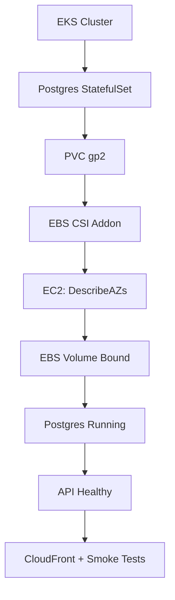
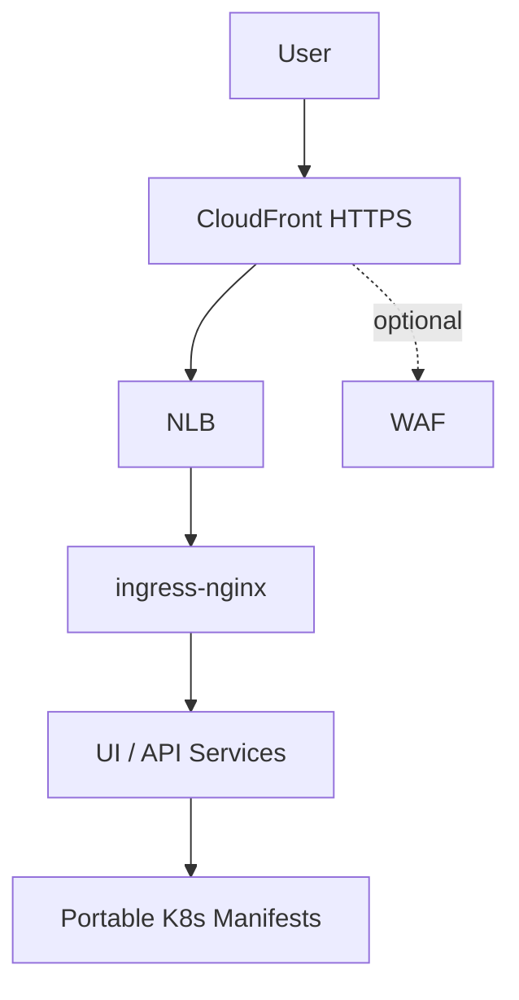
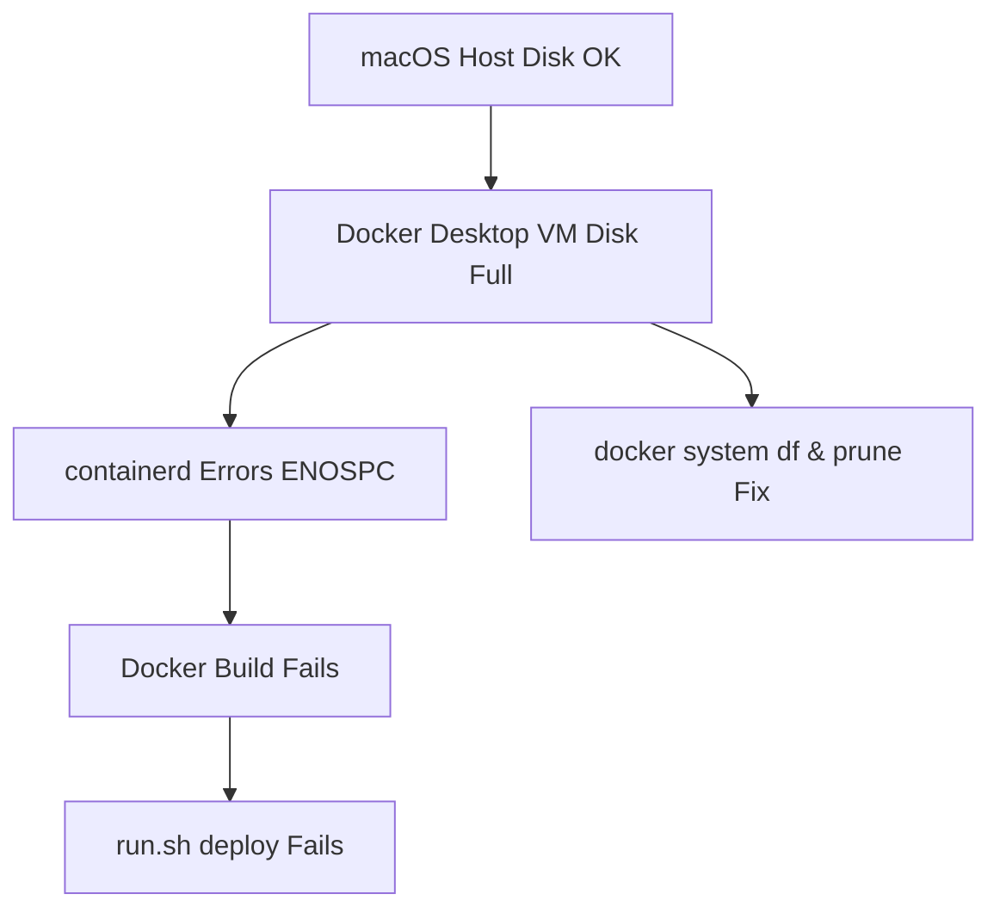
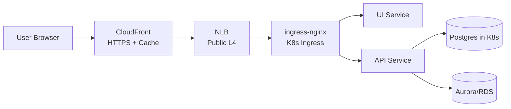
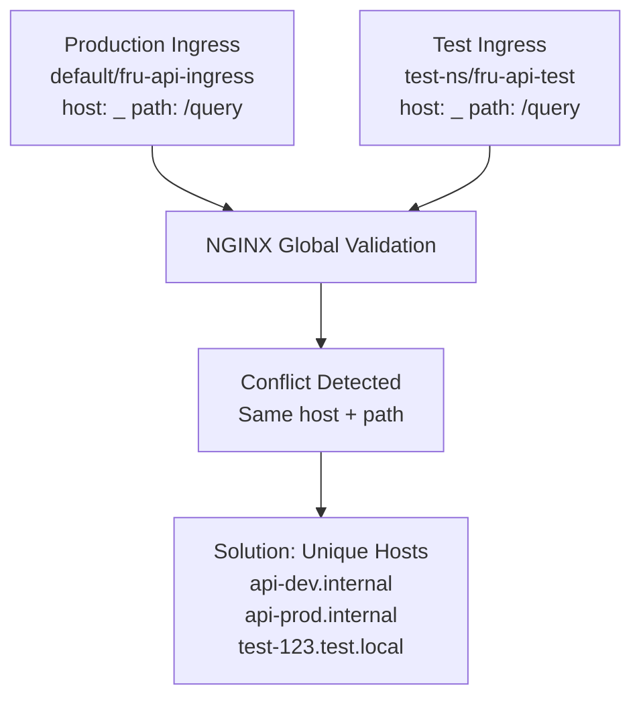
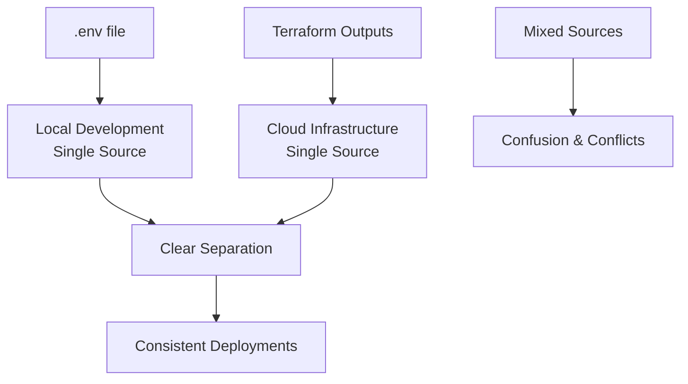
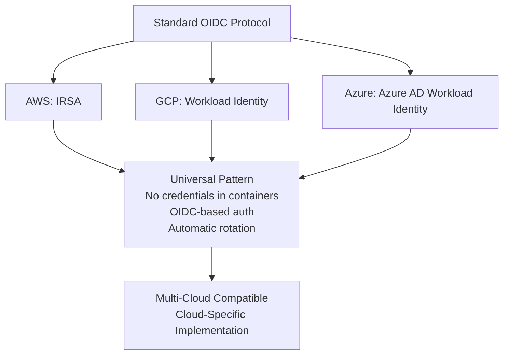
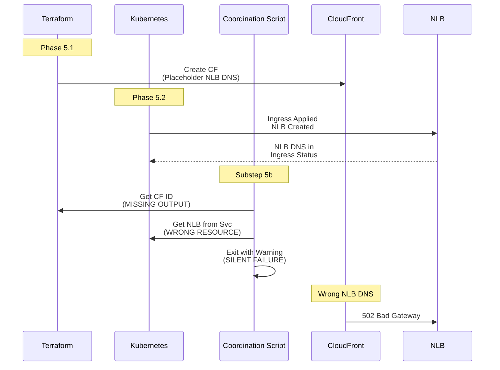
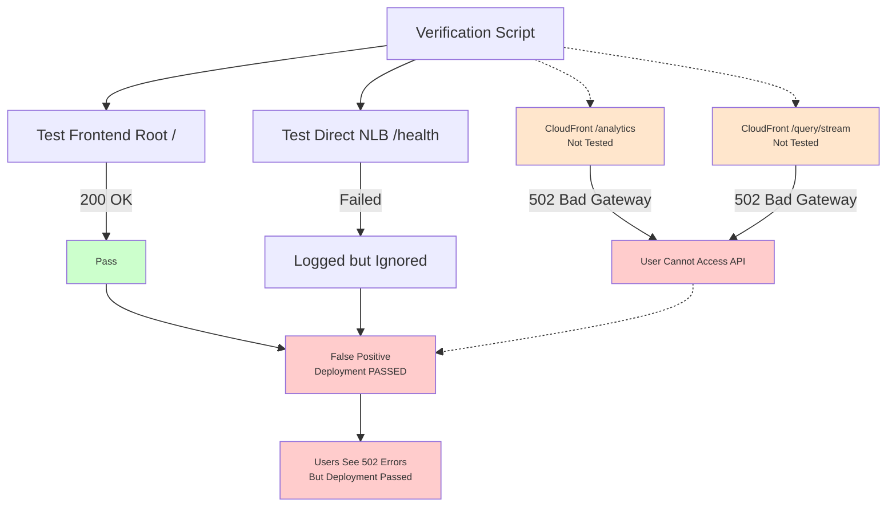

## 1. EKS Storage, EBS CSI Addon, and Idempotent App Deployments

**creation:** `<260121-120000>`  
**last_updated:** `<260121-120000>`

**keywords:** AWS, EKS, Kubernetes, EBS CSI, Terraform, Helm, CloudFront  
**difficulty:** 7  
**significance:** 8  

### 1.1 Context
An EKS-based demo app used Postgres via a StatefulSet and a `gp2` StorageClass. PVCs stayed Pending, Postgres never scheduled, and the API crashed on startup while `run.sh all` hung on deployment readiness.

### 1.2 Root Cause
Dynamic EBS provisioning requires the `aws-ebs-csi-driver` addon plus EC2 IAM permissions on the node role. The cluster lacked both the addon and the `AmazonEBSCSIDriverPolicy` attachment, so the CSI controller crashed with `UnauthorizedOperation` on `ec2:DescribeAvailabilityZones`, blocking volume creation.

### 1.3 Key Insight
> When StatefulSet PVCs hang in Pending on EKS, always validate **both**: the CSI addon health and node-role IAM permissions for EC2 APIs used by that driver.

### 1.4 Resolution
We wired Terraform to attach `AmazonEBSCSIDriverPolicy` to the node IAM role and extended `run_scripts/infra.sh` to create the `aws-ebs-csi-driver` addon when `USE_POST_DB_IN_KUBE=true`. Once the CSI controller stabilized, Postgres scheduled, the API became healthy, and `run.sh all` (infra + deploy + CloudFront + smoke tests) ran idempotently end-to-end.

### 1.5 Diagram

## 2. Cloud-Portable Ingress: NLB, CloudFront, and Idempotent `run.sh`

**creation:** `<260121-120100>`  
**last_updated:** `<260124-200000>`

**keywords:** AWS, EKS, ingress-nginx, NLB, CloudFront, WAF, Bash, Terraform  
**difficulty:** 6  
**significance:** 7  

### 2.1 Context
A “portable core + thin AWS overlay” design needed HTTPS and CDN in front of an EKS ingress, without polluting Kubernetes manifests with cloud specifics, while keeping `run.sh all` idempotent and observable.

### 2.2 Root Cause
Naive approaches hard-wire CloudFront or WAF logic into manifests or Terraform modules, making portability poor and cleanup brittle. Logging and monitoring for `run.sh` were also ad hoc, hiding long waits and partial failures.

### 2.3 Key Insight
> Treat CloudFront, WAF, and NLB as an **AWS-only edge layer**, orchestrated by scripts, while the app and Kustomize base stay cloud-agnostic.

### 2.4 Resolution
We pushed ingress-nginx + app manifests into a portable `k8s/base`, kept EKS specifics in `k8s/overlays/eks`, and added `run_scripts/cloudfront.sh` plus `ENABLE_CLOUDFRONT`. `run.sh` was refactored into stages with colored logs, `wait_with_retry`, log files under `run_logs/`, and `down-all` / `all-preempted` commands so CloudFront, NLB, and ECR are recreated cleanly on every full run.

### 2.5 Diagram

## 3. Docker Desktop “No Space Left on Device” Inside the VM

**creation:** `<260121-120200>`  
**last_updated:** `<260121-120200>`

**keywords:** Docker Desktop, macOS, containerd, disk usage, diagnostics  
**difficulty:** 5  
**significance:** 6  

### 3.1 Context
Running `run.sh deploy` failed early with “Cannot connect to the Docker daemon” on macOS, even though `df -h` on the host showed ample free disk space, blocking image builds for the EKS deployment.

### 3.2 Root Cause
Docker Desktop runs containers inside an internal Linux VM with its own virtual disk. That disk had filled up (logs and old layers), so containerd inside the VM reported “no space left on device”, while the macOS host filesystem still looked healthy, making the failure mode confusing from the outside.

### 3.3 Key Insight
> Docker Desktop disk exhaustion is about the **VM’s virtual disk**, not the macOS host; host `df -h` can look fine while containers still fail with ENOSPC.

### 3.4 Resolution
We added a `cursor_gen/fix_docker.sh` helper to surface Docker Desktop internals: checking `docker system df`, pruning unused images/volumes, and restarting Docker Desktop. The durable fix is to regularly prune from inside Docker’s context and, if necessary, increase the Docker VM disk size rather than chasing space on the macOS host.

### 3.5 Diagram

## 4. Cloud-Native Request Flow from Edge to Data

**creation:** `<260121-120300>`  
**last_updated:** `<260121-120300>`

**keywords:** AWS, CloudFront, NLB, ingress-nginx, microservices, Postgres, Aurora  
**difficulty:** 6  
**significance:** 8  

### 4.1 Context
A portable fridge-stats app needed a clear, reusable pattern for internet traffic: from HTTPS at the edge, through AWS networking, into Kubernetes services, and finally to a database that could be either in-cluster Postgres or a managed service like Aurora.

### 4.2 Root Cause
Ad hoc ingress designs often mix TLS, load balancing, and app routing in a single layer, making it hard to swap clouds or DB backends. Without a well-defined flow—CloudFront → NLB → ingress-nginx → services → DB—security, caching, and observability become tangled and brittle.

### 4.3 Key Insight
> Model traffic as a **layered pipeline**: CloudFront (TLS, caching, WAF) → NLB (L4, public edge) → ingress-nginx (L7 routing) → services → DB (Postgres-in-kube today, Aurora tomorrow).

### 4.4 Resolution
We standardized the flow so CloudFront always terminates HTTPS and optionally adds WAF, the NLB remains public but thin, ingress-nginx handles routing, and services speak plain HTTP inside the cluster. The DB choice is abstracted behind environment and manifests (`USE_POST_DB_IN_KUBE`), letting us flip between StatefulSet Postgres and Aurora without rewriting the edge or service topology.

### 4.5 Diagram

## 5. NGINX Ingress Global Validation: When Different Namespaces Aren't Enough

**creation:** `<260124-153658>`  
**last_updated:** `<260124-153658>`

**keywords:** Kubernetes, ingress-nginx, NGINX, EKS, namespace isolation, admission webhook, ingress conflict  
**difficulty:** 6  
**significance:** 7  

### 5.1 Context
Isolated test namespace deployments failed with ingress conflicts, even though test and production ingresses were in different namespaces with different names. Error: `admission webhook "validate.nginx.ingress.kubernetes.io" denied the request: host "_" and path "/query" is already defined in ingress default/fru-api-ingress`.

### 5.2 Root Cause
NGINX Ingress Controller has a **global validation webhook** that prevents duplicate `host + path` combinations across **ALL namespaces**, not just within a namespace. When no `host` is specified in ingress.yaml, NGINX treats it as wildcard `"_"`, causing conflicts between test and production ingresses even though they're in different namespaces with different names.

### 5.3 Key Insight
> Namespace isolation doesn't apply to NGINX ingress validation. The controller validates `host + path` globally, so different namespaces can still conflict if they share the same host and path combination. Always use unique hosts per environment, not just unique namespaces.

### 5.4 Resolution
We implemented environment-specific ingress hosts via Terraform outputs (`api-dev.internal`, `api-prod.internal`, `test-${TIMESTAMP}.test.local`), converted `ingress.yaml` to `ingress.template.yaml` for dynamic generation, and moved production to a dedicated namespace. This ensures each environment has a unique `host + path` combination, preventing global validation conflicts while maintaining namespace isolation for other resources.

### 5.5 Takeaway
When using NGINX Ingress Controller, always use unique hosts per environment, even if ingresses are in different namespaces. Global validation means namespace isolation doesn't prevent ingress conflicts. Use Terraform outputs to define environment-specific ingress hosts for consistency and maintainability.

### 5.6 Diagram

## 6. Dual Source of Truth: When .env and Terraform Conflict

**creation:** `<260124-153658>`  
**last_updated:** `<260124-153658>`

**keywords:** Terraform, environment variables, configuration management, single source of truth, infrastructure as code, .env file  
**difficulty:** 5  
**significance:** 7  

### 6.1 Context
EKS deployment workflow used both `.env` file and Terraform for configuration, causing inconsistencies. Some values (AWS_REGION) existed in both `.env` and Terraform, leading to confusion about which source was authoritative. Kubernetes deployment scripts read from `.env`, while Terraform used its own configs, creating a dual source of truth that caused deployment failures and configuration drift.

### 6.2 Root Cause
Infrastructure values were mixed between `.env` (intended for local development) and Terraform configs (intended for cloud infrastructure). No clear separation between local and cloud configuration sources, leading to values being defined in multiple places. When scripts read from `.env` but Terraform used different values, deployments failed or behaved unexpectedly.

### 6.3 Key Insight
> Configuration should have a single source of truth per environment type. Local development uses `.env`, cloud infrastructure uses Terraform. Mixing them creates confusion, inconsistencies, and makes it impossible to determine which source is authoritative.

### 6.4 Resolution
We established clear boundaries: `.env` for local development only (including AWS_PROFILE, AWS_REGION for local), Terraform outputs for all cloud infrastructure values (namespace, ingress_host, cluster_name, etc.). Updated deployment scripts to read from Terraform outputs instead of `.env` for cloud deployments, and removed infrastructure values from `.env` that belong in Terraform. This eliminated dual sources of truth and ensured consistency across environments.

### 6.5 Takeaway
Establish clear boundaries: `.env` for local development only, Terraform outputs for cloud infrastructure. This eliminates dual sources of truth and ensures consistency across environments. Each environment type should have one authoritative source, making configuration management predictable and maintainable.

### 6.6 Diagram

## 7. OIDC Provider for IRSA: When Standard Protocols Enable Cloud-Specific Features

**creation:** `<260124-153658>`  
**last_updated:** `<260124-153658>`

**keywords:** OIDC, IRSA, IAM Roles for Service Accounts, EKS, authentication, multi-cloud, AWS, workload identity  
**difficulty:** 7  
**significance:** 8  

### 7.1 Context
EKS application pods were using AWS credentials from Kubernetes Secrets instead of IAM roles, violating security best practices. The infrastructure had OIDC provider configured, but application pods weren't using IRSA (IAM Roles for Service Accounts). Needed to understand whether OIDC Provider for IRSA was AWS-specific or a standard approach that could work across cloud providers for multi-cloud compatibility.

### 7.2 Root Cause
OIDC (OpenID Connect) is a **standard protocol** used by many providers, but IRSA (IAM Roles for Service Accounts) is **AWS-specific**. However, AWS uses the standard OIDC protocol to enable AWS-specific IRSA functionality. The pattern (using OIDC for workload identity) is universal, but each cloud provider implements it differently (AWS: IRSA, GCP: Workload Identity, Azure: Azure AD Workload Identity).

### 7.3 Key Insight
> OIDC Provider for IRSA is a hybrid: standard OIDC protocol (not AWS-specific) enables AWS-specific IRSA implementation. The pattern is universal (no credentials in containers), but implementations are cloud-specific. This allows multi-cloud compatibility at the pattern level while accepting cloud-specific implementations for cloud-specific features.

### 7.4 Resolution
We implemented IRSA for application pods by creating IAM roles with OIDC trust policies, creating Kubernetes service accounts with IRSA annotations (`eks.amazonaws.com/role-arn`), and updating deployments to use service accounts. This eliminated credentials from Kubernetes Secrets and provided automatic credential rotation. For multi-cloud compatibility, we documented that while OIDC is standard, each cloud provider has its own implementation (IRSA for AWS, Workload Identity for GCP, Azure AD for Azure), but the pattern remains consistent.

### 7.5 Takeaway
Use standard protocols (OIDC) for multi-cloud compatibility, but accept cloud-specific implementations (IRSA, Workload Identity) for cloud-specific features. The pattern is universal (no credentials in containers, OIDC-based authentication), the implementation is cloud-specific. This approach provides security benefits while maintaining portability at the pattern level.

### 7.6 Diagram

## 8. Terraform-Kubernetes Coordination: When Timing and Resource Mapping Collide

**creation:** `<260124-200200>`  
**last_updated:** `<260124-200200>`

**keywords:** AWS, EKS, Terraform, Kubernetes, CloudFront, NLB, ingress-nginx, coordination, timing dependency  
**difficulty:** 7  
**significance:** 8  

### 8.1 Context
After establishing the CloudFront → NLB → ingress-nginx pattern, deployments failed silently. CloudFront pointed to a non-existent NLB, causing 502 errors on API endpoints, but the coordination script that should have updated CloudFront failed without clear errors. The deployment workflow has a critical timing dependency between Terraform (creates CloudFront) and Kubernetes (creates NLB via Ingress).

### 8.2 Root Cause
The deployment workflow requires coordination across three phases:
1. **Phase 5.1 (Terraform)**: Creates CloudFront with a placeholder/hardcoded NLB DNS
2. **Phase 5.2 (Kubernetes)**: Applies Ingress, which triggers NGINX Ingress Controller to create the actual NLB
3. **Substep 5b (Shell Script)**: Should update CloudFront with the real NLB DNS from Ingress status

The coordination script failed due to three issues:
- **Missing Terraform Output**: `cloudfront_distribution_id` wasn't exposed in EKS module outputs, so the script couldn't find which CloudFront distribution to update
- **Wrong Resource Check**: Script checked `kubectl get svc fru-api` (ClusterIP Service) instead of `kubectl get ingress fru-api-ingress` (Ingress resource). The NLB DNS appears in Ingress status, not the application Service status, even though NGINX Ingress Controller's Service creates the NLB
- **Silent Failure**: Script exited with a warning instead of failing, leaving CloudFront pointing to the wrong NLB

**Kubernetes Status Field Confusion:**
- NGINX Ingress Controller has its own LoadBalancer Service (`ingress-nginx-controller`) that creates the NLB
- The NLB DNS appears in that Service's status, but NGINX Ingress Controller copies it to the Ingress resource status for convenience
- The application Service (`fru-api`) is ClusterIP and has no LoadBalancer hostname
- The script incorrectly assumed the application Service would have the NLB DNS

### 8.3 Key Insight
> When coordinating Terraform and Kubernetes, you must explicitly map **which resource has the information you need**:
> - **Terraform outputs** → CloudFront distribution ID (must be explicitly exposed, not assumed available)
> - **Ingress status** → NLB DNS (not Service status, even though a Service creates the NLB)
> - **Timing matters**: Terraform runs before Kubernetes, so scripts must wait and retry for async Kubernetes resources
> - **Kubernetes status fields are controller-populated**: The resource that creates something (Service creates NLB) may not be the resource that exposes it conveniently (Ingress status has the DNS)
> - **Fail-fast is critical**: Silent failures in coordination scripts lead to broken deployments that pass verification

### 8.4 Resolution
1. **Exposed Terraform Output**: Added `cloudfront_distribution_id` to EKS module outputs, making it accessible to coordination scripts
2. **Fixed Resource Check**: Changed script to check `kubectl get ingress -o jsonpath='{.status.loadBalancer.ingress[0].hostname}'` instead of checking Service
3. **Added Retry Logic**: Implemented proper retry with timeout for Ingress NLB DNS availability (waits for async NLB creation)
4. **Fail-Fast on Errors**: Updated script to exit with error code when CloudFront update fails, preventing silent failures
5. **Documentation**: Added comments explaining why we check Ingress (not Service) for NLB DNS and how NGINX Ingress Controller copies DNS from its Service to Ingress status

### 8.5 Takeaway
The coordination between Terraform variables, kubectl calls, and kubectl apply results requires explicit mapping of information sources. Don't assume the obvious resource (Service) has the data you need—verify which resource actually exposes it (Ingress status). Always expose Terraform outputs that coordination scripts need, understand which controller populates which status field, and make coordination failures fail-fast with clear error messages. When debugging, trace which controller populates which status field—Kubernetes status is controller-populated, not spec-driven.

### 8.6 Diagram

## 9. False Positive Verification: When Partial Testing Hides Critical Failures

**creation:** `<260124-200100>`  
**last_updated:** `<260124-200100>`

**keywords:** AWS, EKS, CloudFront, verification, testing, false positive, deployment validation  
**difficulty:** 5  
**significance:** 7  

### 9.1 Context
After deploying EKS with CloudFront, the verification script reported "PASSED" even though the frontend showed 502 Bad Gateway errors when accessing API endpoints (`/analytics`, `/query/stream`). Users couldn't use the application, but automated verification didn't catch the issue.

### 9.2 Root Cause
The verification script had incomplete test coverage:
- ✅ **Tested**: Frontend root (`/`) - passed (served static S3 content)
- ✅ **Tested**: Direct ALB/NLB health endpoint - failed (HTTPS/HTTP mismatch, but error was logged and ignored)
- ❌ **Not Tested**: CloudFront API endpoints (`/analytics`, `/query/stream`) - these were the actual user-facing paths
- ❌ **Not Tested**: End-to-end flow through CloudFront to backend

Additionally, the verification script had `|| true` on critical validation calls, causing failures to be silently ignored. The script returned success even when CloudFront was misconfigured.

### 9.3 Key Insight
> Verification must test **the actual user-facing paths**, not just infrastructure health checks. If users access APIs through CloudFront, verification must test CloudFront endpoints, not just direct backend endpoints. Partial testing creates false confidence and hides critical failures.

### 9.4 Resolution
1. **Added CloudFront API Endpoint Validation**: Created `validate_cloudfront_api_endpoints()` function that explicitly tests:
   - `$FRONTEND_URL/analytics` (must return 200 OK)
   - `$FRONTEND_URL/query/stream?query=average%20rating` (must return 200 OK or proper SSE stream)
   
2. **Fail-Fast Logic**: Removed `|| true` from critical validation calls and added explicit `exit 1` when CloudFront API endpoints fail

3. **Enhanced Error Messages**: Added clear error messages explaining that CloudFront API endpoints are critical and must work for the deployment to be considered successful

4. **Version Endpoint Validation**: Added validation for `/version` endpoint to ensure backend version information is accessible

5. **Comprehensive Summary**: Updated verification summary to show which checks passed/failed and why, making it clear when critical paths are broken

### 9.5 Takeaway
Verification scripts must test the **actual user experience**, not just infrastructure components in isolation. If users access APIs through CloudFront, test CloudFront endpoints. If users access through a load balancer, test through the load balancer. Always test the complete request path that users will actually use. Make verification fail-fast on critical failures with clear, actionable error messages.

### 9.6 Diagram

